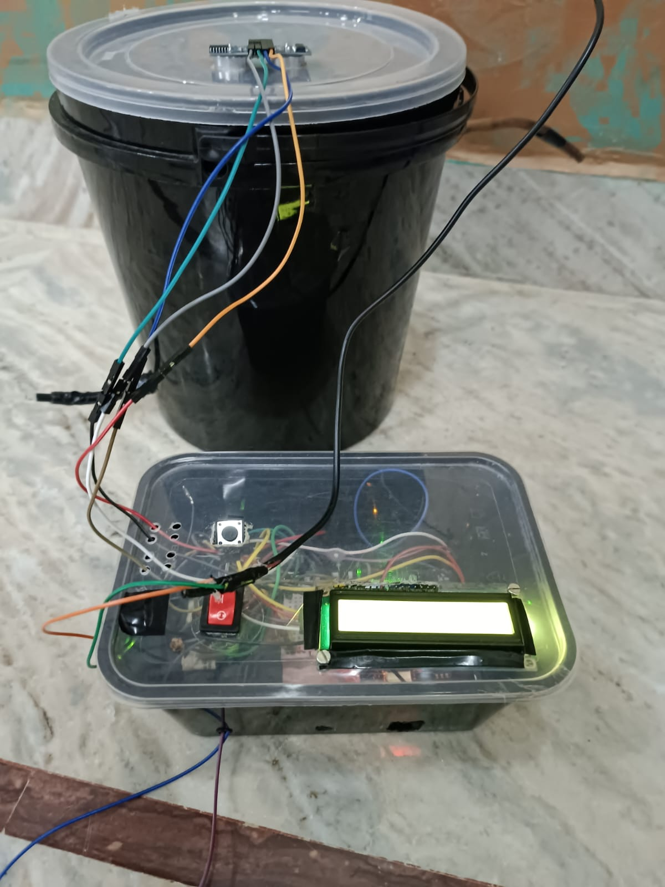
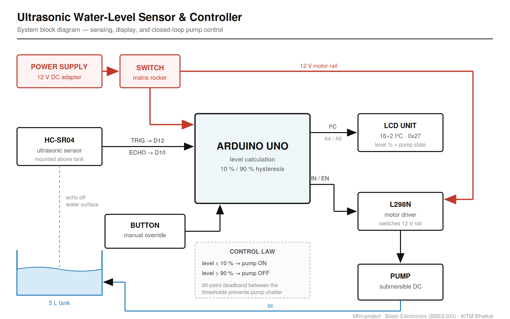

# Ultrasonic Water-Level Sensor & Controller

A closed-loop tank controller: an **HC-SR04** measures the water surface from above, an **Arduino
Uno** converts that distance into a percentage full, and an **L298N** switches a submersible pump
to keep the tank between 10 % and 90 %.

Mini-project for Basic Electronics (BBEE203) at AITM Bhatkal. Team of four, under the guidance of
Prof. Shrishail Bhat. I led the team, split the work and ran the demo.



---

## The problem

Overhead tanks overflow because nobody is watching them. In India that's a meaningful share of
avoidable domestic water loss — a tank left filling is water straight to the drain, and the person
responsible usually finds out from the sound. The cheapest fix isn't a better valve, it's knowing
the level and acting on it automatically.

---

## System



The sensor sits above the water, not in it. Nothing wetted, nothing to corrode, and the tank can be
opened and cleaned without disturbing the electronics.

---

## Control law

```
level < 10 %   →   pump ON
level > 90 %   →   pump OFF
10 % … 90 %    →   pump holds its current state
```

The middle band is the entire design idea. A single threshold — "turn on below 50 %" — sounds
simpler and fails immediately: the water surface ripples, readings jitter across the setpoint, and
the pump switches on and off several times a second. That's called chatter, and it destroys relays
and motor drivers.

Two thresholds with an 80-point gap between them means the level has to travel a long way before
the decision reverses. The pump can't oscillate because there's no state it can sit in where the
next reading flips it back.

## The failsafe is mechanical, not software

The overflow outlet is plumbed so that if the pump does run too long, water leaves the tank through
a route that goes nowhere near the electronics.

This is the part of the project I'd defend hardest. The control logic above is only as good as the
sensor feeding it — an HC-SR04 that gets a bad echo, or a wire that comes loose, and the software
is confidently wrong. So the system is arranged so that the *worst* thing bad software can do is
waste water, not destroy the board or create a shock hazard. Software failsafes protect against
bugs you thought of. Physical ones protect against the bugs you didn't.

---

## Hardware

| Part | Role |
|---|---|
| Arduino Uno | Level calculation and control |
| HC-SR04 | Ultrasonic distance to water surface |
| 16×2 I²C LCD (0x27) | Level percentage and pump state |
| L298N | Motor driver switching the 12 V pump rail |
| Submersible DC pump | Fills the tank |
| Rocker switch | Mains isolation |
| Tact button | Manual pump override |
| 12 V DC adapter | Supply |

**Pin map**

```
HC-SR04   TRIG → D12      ECHO → D10
LCD       SDA  → A4       SCL  → A5
L298N     IN1  → D7       ENA  → D6
Button    D2 → GND (INPUT_PULLUP)
```

Libraries: `NewPing`, `Wire`, `LiquidCrystal_I2C`.

**Accuracy:** roughly half a centimetre in practice, which is about what an HC-SR04 gives you. That
figure is from observation during testing, not a characterised measurement — treat it as an
estimate.

---

## Repository layout

```
├── src/
│   ├── water_level_controller.ino          ← the controller
│   └── water_level_measure_ORIGINAL.ino    ← original sensing-only sketch, kept as-is
├── test/
│   └── logic_test.cpp                      ← PC-side tests for the control logic
└── docs/
    ├── images/       block diagram + finished build
    ├── report/       full seminar deck — methodology, components, references
    └── video/        demo presentation
```

---

## Testing

The control logic is duplicated in `test/logic_test.cpp` with the Arduino calls removed, so it can
be compiled and run on a PC:

```bash
cd test && g++ -Wall -O1 -o logic_test logic_test.cpp && ./logic_test
```

Sixteen checks covering the percentage conversion and its clamping, the switching points on a fill
and a drain, chatter resistance against a jittering mid-band reading, override precedence against
the full-tank cutoff, and the fail-safe path. All pass.

This tests the decision logic only — the sensor, the display and the L298N are not exercised here,
so it does not replace running the sketch on real hardware.

---

## Status

The system was built and demonstrated, pump included, driven through the L298N.

**The original controller sketch did not survive.** `water_level_measure_ORIGINAL.ino` is the
earlier sensing-and-display stage — it reads the sensor and prints to the LCD, with no pump logic.
The complete version was lost.

`water_level_controller.ino` is therefore a **rewrite from the documented design**, not a recovered
original, and it is labelled that way deliberately. Its logic is verified by the tests above; it
has not yet been re-run on the hardware.

The original sketch is kept unmodified, faults included — it only refreshed the display below
14 cm, so outside that window it held a stale reading indefinitely. Leaving it visible is more
useful than quietly deleting it.

---

## Team

Salsabeel Kobattey · Shayan Ahmed · Nawwaf Peshmam · Mohammed Ruwaif
Guide: Prof. Shrishail Bhat, Dept. of ECE, AITM Bhatkal
