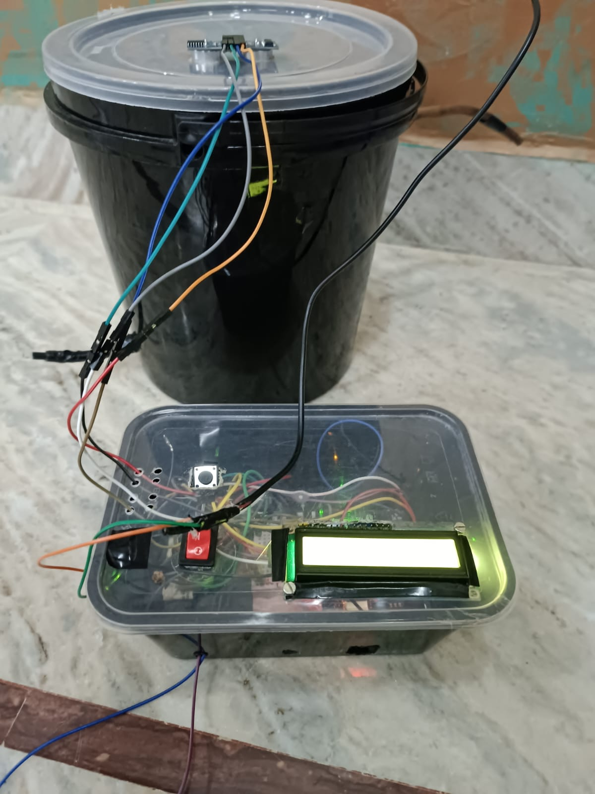
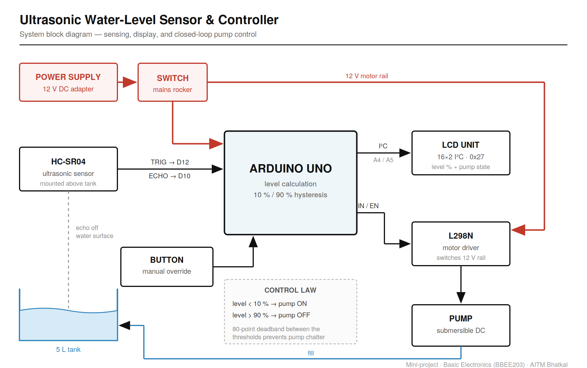
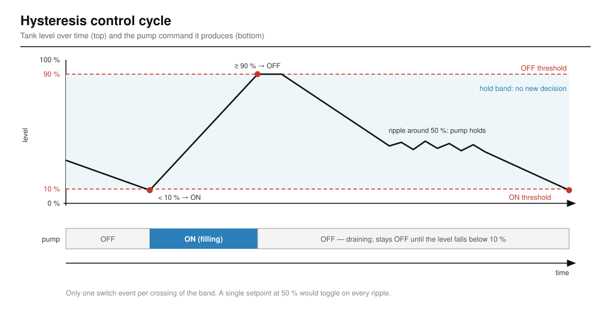

# Ultrasonic Water-Level Sensor & Controller — Project Report

**Course:** Basic Electronics (BBEE203) — Mini-project
**Institution:** Anjuman Institute of Technology and Management (AITM), Bhatkal
**Team:** Salsabeel Kobattey (team lead) · Shayan Ahmed · Nawwaf Peshmam · Mohammed Ruwaif
**Guide:** Prof. Shrishail Bhat, Assistant Professor, Dept. of ECE, AITM
**License:** MIT

---

## Contents

1. [Summary](#1-summary)
2. [Problem and motivation](#2-problem-and-motivation)
3. [Objectives](#3-objectives)
4. [System overview](#4-system-overview)
5. [Hardware](#5-hardware)
6. [Sensing principle](#6-sensing-principle)
7. [From distance to percentage full](#7-from-distance-to-percentage-full)
8. [Control law: two-threshold hysteresis](#8-control-law-two-threshold-hysteresis)
9. [Manual override](#9-manual-override)
10. [Fault handling and safety](#10-fault-handling-and-safety)
11. [Firmware architecture](#11-firmware-architecture)
12. [The original sketch and how the design changed](#12-the-original-sketch-and-how-the-design-changed)
13. [Testing and verification](#13-testing-and-verification)
14. [Results and discussion](#14-results-and-discussion)
15. [Known limitations and review findings](#15-known-limitations-and-review-findings)
16. [Future work](#16-future-work)
17. [Building, calibrating and running](#17-building-calibrating-and-running)
18. [Repository layout](#18-repository-layout)
19. [References](#19-references)

---

## 1. Summary

The project is a closed-loop controller for a water tank. It keeps the tank between 10 % and 90 %
full without anyone watching it:

- An **HC-SR04** ultrasonic sensor mounted in the lid measures the distance down to the water
  surface. Nothing touches the water.
- An **Arduino Uno** turns that distance into a percentage full and decides whether the pump should
  run.
- An **L298N** motor driver switches a 12 V **submersible DC pump** on and off.
- A **16×2 I²C LCD** shows the level and the pump state. A **push-button** lets the user start the
  pump by hand.

The main design decision is the control law. It uses **two thresholds with a wide gap between
them**: start the pump below 10 %, stop it at 90 %, and change nothing in between. Because of that
gap, ripples on the water surface cannot make the pump switch rapidly on and off ("chatter"). The
second decision is about safety. The firmware stops the pump when the sensor stops returning
echoes, and the overflow outlet is **plumbed** so that even a software failure can only waste
water. It cannot flood the electronics.

The system was built and demonstrated with the pump running. The original controller firmware was
lost. The version in this repository is a **rewrite from the documented design**. Its decision
logic passes a 16-check PC test suite, but it has **not yet been run again on the hardware**.



*Figure 1 — The finished build. The HC-SR04 is mounted in the bucket lid and points down at the
water. The control enclosure (front) holds the Arduino, the L298N, the rocker switch, the
override button and the LCD.*

---

## 2. Problem and motivation

Overhead and storage tanks overflow because nobody is watching them. A tank left filling sends
water straight down the drain, and the person responsible usually finds out from the sound. In
India, overflowing storage tanks and the lack of real-time level monitoring make up a meaningful
share of avoidable domestic water loss. The seminar deck cites an estimate of about 45 million
cubic metres wasted per day in urban areas, and roughly 30 % of the global supply lost each year to
inefficient use and monitoring (see [References](#19-references)).

The cheapest fix is not a better valve. It is **knowing the level and acting on it
automatically**. The system therefore has to:

1. measure the level without being damaged by the water it measures,
2. show that level to a person, and
3. turn the supply off before the tank overflows and on again before it runs dry, without a human
   in the loop.

---

## 3. Objectives

| # | Objective | How the design meets it |
|---|---|---|
| 1 | **Accurate measurement** | The HC-SR04 time-of-flight reading uses a 5-ping median filter, and the tank geometry is set in two calibration constants. |
| 2 | **Real-time monitoring** | The level is sampled every 300 ms and shown on the LCD. The display is redrawn only when a value changes, so it does not flicker. |
| 3 | **Automatic control** | The 10 % / 90 % hysteresis controller drives the pump through the L298N. |
| 4 | **Low cost** | The system uses only common hobby-grade parts (Uno, HC-SR04, L298N, I²C LCD, small DC pump). |
| 5 | **User-friendly, low maintenance** | The sensor never touches the water, the tank can be opened and cleaned without disturbing the electronics, and a one-button manual override is provided. |
| 6 | **Safe failure** | The pump is off at power-up, stops on sensor dropout, and cannot be overridden past the full-tank limit. A mechanical overflow path is the last line of defence. |

---

## 4. System overview



*Figure 2 — System block diagram. Red lines carry power, black lines carry signals, and blue lines
carry water.*

The system is a classic **sense → decide → act** feedback loop:

```
         ┌──────────────── water level (physical feedback) ───────────────┐
         │                                                                │
         ▼                                                                │
   ┌───────────┐   echo time   ┌──────────────┐   IN1/ENA   ┌────────┐  ┌──┴───┐
   │  HC-SR04  │ ────────────► │ Arduino Uno  │ ──────────► │ L298N  │─►│ Pump │
   │ (in lid)  │               │ % + control  │             └────────┘  └──────┘
   └───────────┘               └──────┬───────┘                ▲
                                      │ I²C                    │ 12 V motor rail
                   Button (D2) ──────►│                        │
                                      ▼                 12 V adapter → rocker switch
                                  16×2 LCD
```

**Power.** A 12 V DC adapter feeds a rocker switch. After the switch, the 12 V rail goes two ways:
to the L298N motor supply (which drives the pump) and to the Arduino's barrel/VIN input, where the
Uno's on-board regulator produces the 5 V logic rail. The sensor and the LCD run from the
Arduino's 5 V.

**Mounting.** The HC-SR04 sits in the tank lid and looks down, so it is **above the water, not in
it**. There are no wetted electrodes to corrode, and the tank can be opened and cleaned without
touching any wiring. The prototype tank is a bucket of about 5 L.

---

## 5. Hardware

### 5.1 Bill of materials

| Part | Role | Key characteristics |
|---|---|---|
| Arduino Uno (ATmega328P) | Level calculation, control, UI | 16 MHz, 32 KB flash, 2 KB SRAM, 5 V logic; 7–12 V recommended input |
| HC-SR04 | Ultrasonic distance to the water surface | 40 kHz, ~2–400 cm range, ~15° beam, 10 µs trigger pulse, 5 V |
| 16×2 LCD with I²C backpack (PCF8574, address `0x27`) | Shows level % and pump state | Needs only 2 signal wires (SDA/SCL) |
| L298N dual H-bridge module | Switches the 12 V pump rail from 5 V logic | Up to ~2 A per channel; bipolar output stage drops roughly 2 V or more |
| Submersible DC pump | Fills the tank | Runs from the 12 V rail through the L298N |
| Rocker switch | Isolates the supply | Cuts power to the whole system |
| Tactile push-button | Manual pump override | Wired to ground, internal pull-up |
| 12 V DC adapter | Supply | Feeds both the motor rail and the Arduino |

Libraries: **`NewPing`** (ultrasonic timing and median filtering), **`Wire`** (I²C), and
**`LiquidCrystal_I2C`** (LCD).

### 5.2 Pin map

| Device | Signal | Arduino pin | Notes |
|---|---|---|---|
| HC-SR04 | TRIG | D12 | Output: 10 µs trigger pulse |
| HC-SR04 | ECHO | D10 | Input: pulse width = round-trip time |
| LCD | SDA | A4 | Hardware I²C on the Uno |
| LCD | SCL | A5 | Hardware I²C on the Uno |
| L298N | IN1 | D7 | Direction A (HIGH = forward) |
| L298N | IN2 | D8 | Direction B (held LOW) |
| L298N | ENA | D6 | Channel enable. D6 supports PWM, which leaves room for speed control later. |
| Button | — | D2 → GND | `INPUT_PULLUP`, so the pin reads LOW when pressed |

> **IN2 and the top-level README.** The controller sketch drives IN2 on **D8**. The pin map in the
> top-level README lists only IN1 and ENA. When rewiring, follow the header of
> `src/water_level_controller.ino`.

### 5.3 Wiring rules that matter

- **Common ground.** The L298N and the Arduino **must share a ground**. The driver compares its
  logic inputs against its own ground. Without a common reference it "does nothing", and this is
  the most common reason a motor driver appears dead.
- **Pump rail vs logic rail.** The pump current flows only through the L298N's 12 V supply and
  output stage. The Arduino only supplies a few milliamps of logic current into IN1/IN2/ENA.
- **Voltage drop.** The L298N is a bipolar H-bridge, so the pump sees noticeably less than 12 V
  (typically around 10 V). This is acceptable for a small pump, but it explains why the pump
  sounds weaker than it does when connected directly to the adapter.

---

## 6. Sensing principle

### 6.1 Time of flight

The HC-SR04 works like sonar:

1. The Arduino holds **TRIG** high for 10 µs.
2. The module sends a burst of eight 40 kHz ultrasonic pulses.
3. The burst reflects off the water surface and comes back.
4. The module holds **ECHO** high for exactly as long as the sound took to travel down and back.

Because the sound travels the distance twice:

$$
d = \frac{t \times v_{\text{sound}}}{2}
$$

At about 20 °C, $v_{\text{sound}} \approx 343\ \text{m/s} = 0.0343\ \text{cm/µs}$, so

$$
d\ [\text{cm}] \approx \frac{t\ [\text{µs}] \times 0.0343}{2} \approx \frac{t\ [\text{µs}]}{58}
$$

The NewPing library makes this conversion in `convert_cm()` using a round-trip constant of
57 µs/cm, and it rounds the result to a **whole centimetre**. For scale, a surface 3 cm away echoes
back in about 170 µs, and one 14 cm away in about 800 µs.

### 6.2 Why the median, not the average

A single ping off a moving water surface is noisy. Ripples, splashes from the pump outlet and
echoes off the tank wall all produce outliers. The firmware calls

```cpp
unsigned int us = sonar.ping_median(PING_SAMPLES);   // PING_SAMPLES = 5
```

which fires five pings and returns the middle value. A **median** throws away outliers completely
instead of mixing them into the result, and it adds no lag from old samples the way a running
average does. That combination suits a controller.

### 6.3 A reading of zero means "no echo"

NewPing returns `0` when no echo arrives within the time-out. This happens when the target is out
of range, the surface is at a bad angle, or the sensor is disconnected. **Zero does not mean "the
water is touching the sensor".** A naïve controller that treated it as a real distance would read
the tank as 100 % full and stop the pump. That particular error fails safe. The opposite
assumption, treating 0 as "empty", would run the pump forever, which is how a controller floods a
room. Section 10 describes how the firmware handles dropouts.

---

## 7. From distance to percentage full

### 7.1 The mapping is inverted

The sensor looks **down**, so a **larger distance means less water**. Written the intuitive way
round, the formula makes the pump do exactly the wrong thing. Two calibration constants define the
tank:

| Constant | Meaning | Default |
|---|---|---|
| `SENSOR_TO_EMPTY` | Reading with the tank empty: the surface is furthest away, so this is the **larger** number | 14.0 cm |
| `SENSOR_TO_FULL` | Reading with the tank full: the surface is nearest, so this is the **smaller** number | 3.0 cm |

$$
\text{level}\,\% = \operatorname{clamp}_{0}^{100}\!\left(\frac{\text{SENSOR\_TO\_EMPTY} - d}{\text{SENSOR\_TO\_EMPTY} - \text{SENSOR\_TO\_FULL}} \times 100\right)
$$

The defaults were **inferred** from the original 2024 sketch, which used 12.5 cm as a reference and
treated anything under 14 cm as "deep". They are a starting point, not measurements, and must be
recalibrated on the real tank (section 17.2).

### 7.2 Implementation details

```cpp
int distanceToPercent(float distanceCm) {
  const float span = SENSOR_TO_EMPTY - SENSOR_TO_FULL;
  if (span <= 0.0) return 0;                    // misconfigured constants
  float pct = ((SENSOR_TO_EMPTY - distanceCm) / span) * 100.0;
  if (pct <   0.0) pct =   0.0;
  if (pct > 100.0) pct = 100.0;
  return (int)(pct + 0.5);                      // round, don't truncate
}
```

- **Guard against bad configuration.** If someone swaps the two constants, the span becomes zero or
  negative. The function then returns 0 % instead of dividing by zero or inverting the control.
- **Clamping.** A stray echo off a ripple or the tank wall can read *shorter* than
  `SENSOR_TO_FULL`, which would otherwise give values like 118 %. Readings beyond
  `SENSOR_TO_EMPTY` would likewise go negative.
- **Rounding.** Adding 0.5 before the integer cast rounds to the nearest percent instead of always
  rounding down.

### 7.3 Resolution with the default geometry

`convert_cm()` returns whole centimetres, and the default span is only 11 cm. The controller can
therefore only ever see **12 distinct levels**, spaced about 9 % apart:

| Distance (cm) | ≤ 3 | 4 | 5 | 6 | 7 | 8 | 9 | 10 | 11 | 12 | 13 | ≥ 14 |
|---|---|---|---|---|---|---|---|---|---|---|---|---|
| **Level (%)** | 100 | 91 | 82 | 73 | 64 | 55 | 45 | 36 | 27 | 18 | 9 | 0 |

In practice, the pump **starts when the sensor reads 13 cm (9 %)** and **stops when it reads 4 cm
(91 %)**. This works correctly, but it shows that on a small tank the whole-centimetre rounding,
not the sensor, limits the resolution. On a taller tank, the same 1 cm step is a much smaller
percentage. Section 15 describes a fix for small tanks.

---

## 8. Control law: two-threshold hysteresis

### 8.1 The rule

```
level < 10 %   →   pump ON
level ≥ 90 %   →   pump OFF
10 % … 90 %    →   pump keeps doing whatever it was doing
```



*Figure 3 — Over one cycle, the pump switches on once at the bottom of the band and off once at the
top. Ripples inside the band cause no switching.*

### 8.2 Why not a single setpoint?

"Turn the pump on below 50 %" sounds simpler, and it fails at once. The water surface ripples, so
successive readings jitter back and forth across the setpoint, and the pump switches on and off
several times a second. This is called **chatter**. It destroys relays, stresses motor drivers and
wears out pumps.

With two thresholds 80 percentage points apart, the level must travel a long way before the
decision can reverse. No reading exists that the pump can sit at where the next reading flips it
back, so oscillation is impossible by construction. The hold region in the middle is the core of
the design.

### 8.3 Why state is required

Hysteresis needs **memory**. Inside the band the controller makes no new decision, so it has to
remember what it was already doing. That memory is the `pumpRunning` flag. Without it, the
controller would have no state to hold.

### 8.4 The controller as code

```cpp
void updatePump(int levelPercent) {
  if (sensorFailed) {                 // no trustworthy reading -> fail safe
    pumpRunning = false;
    return;
  }
  if (levelPercent >= PUMP_OFF_ABOVE) {
    pumpRunning = false;
    overrideOn  = false;              // cancel override once full
    return;
  }
  if (overrideOn) {
    pumpRunning = true;
    return;
  }
  if (levelPercent < PUMP_ON_BELOW) {
    pumpRunning = true;
  }
  // else: between thresholds. Hold state. This blank is intentional.
}
```

The order of the checks sets the **priority**. From highest to lowest:

| Priority | Condition | Result |
|---|---|---|
| 1 | Sensor fault | Pump **OFF** |
| 2 | Level ≥ 90 % | Pump **OFF**, override cancelled |
| 3 | Override active | Pump **ON** |
| 4 | Level < 10 % | Pump **ON** |
| 5 | Otherwise (10–89 %) | **No change** |

### 8.5 Complete state-transition table

| Current state | Input | Next state |
|---|---|---|
| OFF | level < 10 % | **ON** |
| OFF | 10 % ≤ level < 90 % | OFF (hold) |
| OFF | level ≥ 90 % | OFF |
| ON | level < 90 % | ON (hold) |
| ON | level ≥ 90 % | **OFF** |
| any | override pressed, level < 90 % | **ON** |
| any | sensor fault | **OFF** |

---

## 9. Manual override

A momentary push-button on D2 toggles `overrideOn`. The override lets the user **start the pump
early**, for example to top the tank up at 50 % instead of waiting for it to fall below 10 %.

The **90 % cut-off is checked before the override**. The override can start the pump, but it
**cannot overfill the tank**. When the level reaches 90 %, the pump stops and the override clears
itself, so the system goes back to automatic mode without the user having to remember. An override
that defeated every limit would not be an override. It would be a way to flood a room.

### Debouncing

A mechanical contact bounces for a few milliseconds when pressed. Without debouncing, one press
reads as several, and the override toggles an unpredictable number of times. `overridePressed()`
accepts a new state only after the input has been stable for more than `DEBOUNCE_MS` (50 ms). It
returns `true` once per genuine press, on the pressed (LOW) edge only.

---

## 10. Fault handling and safety

The safety design has layers. Each layer covers failures that the layers above it miss.

### 10.1 Safe start-up

```cpp
pumpRunning = false;
applyPumpOutput();          // first thing in setup(), before the LCD or Serial
```

Until firmware drives an output pin, its state is not something to rely on. On a pin that controls
a pump, "undefined" is not acceptable, so actuators start in their safe state before anything else
runs.

### 10.2 Sensor dropout counter

- A **single** zero reading (no echo) is normal on a rippling surface. The reading is ignored and
  the last good level is kept.
- **Five consecutive** zero readings (`MAX_BAD_READINGS`) are treated as a real fault. The
  firmware sets `sensorFailed`, **turns the pump off immediately**, shows `SENSOR FAULT` on the
  LCD, and logs the fault over serial.
- At the 300 ms sample interval, a real fault is detected in about **1.5 s**.
- The first valid reading clears the fault and resets the counter, so the system recovers
  automatically when a loose wire is reseated.

### 10.3 Override cannot beat the full limit

This is covered in section 9. It removes a whole class of human error.

### 10.4 The mechanical fail-safe

The overflow outlet is **plumbed** so that if the pump ever runs too long, the excess water leaves
the tank by a route that goes **nowhere near the electronics**.

This is the part of the design the team would defend hardest. The control logic is only as good as
the sensor feeding it. If the HC-SR04 gets a bad echo, or a wire comes loose, the software is
confidently wrong. The system is therefore arranged so that the **worst thing bad software can do
is waste water**, not destroy the board or create a shock hazard.

> Software fail-safes protect against the bugs you thought of. Physical ones protect against the
> bugs you didn't.

---

## 11. Firmware architecture

### 11.1 File

The controller is `src/water_level_controller.ino`, a single Arduino sketch of about 300 lines.
It is organised into pins, tank geometry, control settings, objects, state and functions.

### 11.2 Configuration constants

| Constant | Value | Purpose |
|---|---|---|
| `SENSOR_TO_EMPTY` / `SENSOR_TO_FULL` | 14.0 / 3.0 cm | Tank geometry (calibrate) |
| `PUMP_ON_BELOW` / `PUMP_OFF_ABOVE` | 10 / 90 % | Hysteresis thresholds |
| `SAMPLE_INTERVAL_MS` | 300 ms | Sensor sampling period |
| `PING_SAMPLES` | 5 | Median filter depth |
| `MAX_BAD_READINGS` | 5 | Consecutive dropouts before a fault |
| `DEBOUNCE_MS` | 50 ms | Button debounce window |
| `MAX_DISTANCE` | 200 cm | NewPing time-out ceiling |

### 11.3 Main loop

```
loop()
 ├─ poll button (every pass) ──► toggle override on a debounced press
 ├─ less than 300 ms since last sample? ──► return  (non-blocking scheduler)
 ├─ ping_median(5) → convert_cm()
 ├─ distance == 0 ?
 │     ├─ yes: badReadings++ ; if ≥ 5 → sensorFailed, pump OFF, LCD "SENSOR FAULT"
 │     │       return
 │     └─ no : badReadings = 0 ; sensorFailed = false
 ├─ level = distanceToPercent(distance)
 ├─ updatePump(level)        ← decision
 ├─ applyPumpOutput()        ← actuation (IN1, IN2, ENA)
 ├─ updateDisplay(level)     ← only if something changed
 └─ Serial log: dist=…cm level=…% pump=ON/OFF [MANUAL]
```

### 11.4 Design choices in the firmware

- **Scheduling with `millis()` instead of `delay()`.** `delay(300)` would block the processor, and
  button presses during that time would be missed. Comparing timestamps lets the sensor run at its
  own rate while the loop keeps spinning. Unsigned subtraction (`millis() - lastSampleMs`) also
  stays correct when `millis()` rolls over after about 49.7 days.
- **Keeping decision and actuation apart.** `updatePump()` only changes state, and
  `applyPumpOutput()` only writes pins. The decision logic is therefore pure and can be tested on a
  PC (section 13).
- **L298N drive.** IN1 HIGH with IN2 LOW means forward. With ENA LOW, the channel is disabled and
  the motor coasts. The pump is a one-direction load, so IN2 is always LOW.
- **Flicker-free LCD.** The firmware never calls `lcd.clear()`, because clearing and redrawing on
  every cycle flickers visibly. Each line is padded to a fixed 16 characters, so when `100%` drops
  to `45%` the old digit is overwritten by a space instead of lingering as `450%`. The display is
  rewritten only when the level, pump, override or fault state changes, which also keeps the I²C
  bus quiet.
- **Flash strings.** Serial messages use `F("…")`, which keeps constant strings in flash instead of
  the Uno's 2 KB of SRAM.

### 11.5 Display layout

```
┌────────────────┐        ┌────────────────┐
│Level:  45%     │        │SENSOR FAULT    │
│Pump: ON        │        │Pump: OFF       │
└────────────────┘        └────────────────┘
   normal operation            sensor fault
```

---

## 12. The original sketch and how the design changed

The system was built and demonstrated with the pump driven through the L298N. However, **the
complete original controller sketch did not survive.** The repository keeps what did survive, and
labels it honestly:

| File | Status |
|---|---|
| `src/water_level_measure_ORIGINAL.ino` | The original **sensing-and-display** stage from 2024, kept unmodified. It has no pump logic. |
| `src/water_level_measure.ino` | A byte-for-byte copy of the original. |
| `src/water_level_controller.ino` | A **rewrite from the documented design**. It is not a recovered original. |

### Faults in the original sketch (kept deliberately)

```cpp
if (distance > 0 && distance < 14) {
  adjustedDistance = 12.50 - distance;
  lcd.clear();
  ...
}
delay(150);
```

1. **Stale display.** The LCD was refreshed only when the reading was under 14 cm. Outside that
   window, it kept showing the last value indefinitely, so a sensor that had lost the surface
   looked as if it was still working.
2. **Inconsistent reference.** It subtracted from 12.5 cm but accepted readings up to 13 cm, which
   produces negative "depths".
3. **Flicker.** It called `lcd.clear()` on every update.
4. **Blocking loop.** Using `delay(150)` stalls everything else.
5. **No filtering.** A single `ping_cm()` per cycle meant every ripple reached the display.

The rewrite fixes each of these problems. The original is kept because leaving it visible is more
useful than quietly deleting it.

### Differences from the seminar deck

The seminar deck describes the design at the time of the demo. It mentions the `HCSR04.h`
library, while the rewrite uses **NewPing** for its median filtering and time-out handling. The
deck's objectives focus on measurement and display, while the delivered system and the rewrite add
closed-loop pump control, the override and fault handling.

---

## 13. Testing and verification

### 13.1 Approach

Bugs in control logic are painful to find on a bench. An inverted percentage, a hysteresis band
that does not actually hold state, or an override that ignores the full-tank cut-off can all look
fine for a few minutes. The two pure functions, `distanceToPercent()` and `updatePump()`, are
therefore **duplicated in `test/logic_test.cpp` with the Arduino calls removed**, so they can be
compiled and run on a PC:

```bash
cd test && g++ -Wall -O1 -o logic_test logic_test.cpp && ./logic_test
```

The program exits with the number of failures, so it can gate a CI job.

### 13.2 The 16 checks

| Group | Check | Expected |
|---|---|---|
| Conversion | Empty (14.0 cm) | 0 % |
| | Full (3.0 cm) | 100 % |
| | Midpoint (8.5 cm) | 50 % |
| | Clamp low: 20 cm (beyond empty) | 0 % |
| | Clamp high: 1 cm (closer than full) | 100 % |
| | Inverted: 5 cm reads higher than 12 cm | true |
| Hysteresis | Slow fill from 0 %: pump turns ON at | 0 % |
| | …and turns OFF at | exactly 90 % |
| | Slow drain from 100 %: pump turns ON again at | 9 % (not 90 %) |
| | Transitions across a full cycle | exactly 3 |
| Chatter | Ripple 47–53 % around the midpoint: switch events | 0 |
| | Pump holds its previous state | ON |
| Override | Override starts the pump mid-band | ON |
| | 90 % cut-off beats override | OFF |
| | Override clears itself when full | cleared |
| Fault | Fault stops the pump even with override on | OFF |

### 13.3 Status

The project README records that **all 16 checks pass**. For this report, the conversion table in
section 7.3 and the switching points were re-derived independently and agree with the tests.

### 13.4 What the tests do *not* cover

The tests exercise the **decision logic only**. They do not exercise the sensor, the I²C display,
the L298N, button debouncing, the dropout counter in `loop()`, or timing. The functions are also
*copied* into the test file, not shared, so a change to the sketch must be copied into the test by
hand. The tests do not replace running the sketch on real hardware.

---

## 14. Results and discussion

- **Built and demonstrated.** The full system, pump included, worked at the course demonstration
  (Figure 1). A demo video is in `docs/video/demo_presentation.mp4`, and the seminar deck is in
  `docs/report/seminar_deck.pptx`.
- **Accuracy.** In practice the accuracy was about ±0.5 cm, which is typical for an HC-SR04. This
  figure comes from observation during testing, **not a characterised measurement**, so treat it
  as an estimate. The rewrite's whole-centimetre conversion is coarser than that (section 7.3).
- **Water conservation.** Automatic cut-off at 90 % removes the "someone forgot the pump" overflow
  case, which was the original motivation.
- **Reliability.** The non-contact sensor has no parts that corrode. The median filter and the
  dropout counter absorb ripple noise.
- **Scalability.** The same code serves a larger tank after changing two constants. With a taller
  tank, each centimetre step becomes a smaller percentage, so resolution improves.
- **Energy efficiency.** The pump runs only when it is needed, and the hysteresis band avoids the
  inrush current of repeated restarts.
- **User interface.** The LCD shows the level and pump state at a glance. The single button covers
  the one manual action a user actually needs.

---

## 15. Known limitations and review findings

A review of the current rewrite found the following points. None of them affects the safety
guarantees above. They are listed so the next hardware run can address them.

| # | Finding | Effect | Suggested fix |
|---|---|---|---|
| 1 | **Coarse resolution.** `convert_cm()` returns whole centimetres, which gives about 9 % steps on the default 11 cm span. | The pump actually switches at 9 % and 91 %. The display jumps in about 9 % steps. | Convert the median echo time directly: `float d = us / 57.0;` (or use the speed of sound) and pass the float to `distanceToPercent()`. |
| 2 | **LCD line overflow in manual mode.** `"Pump: %-3s%-7s"` with `"[MANUAL]"` is 17 characters, and the buffer holds 16. | `snprintf` truncates safely, but the display shows `Pump: ON [MANUAL` without the closing bracket. | Use a shorter tag such as `[MAN]` or `MANUAL`. |
| 3 | **Blind zone.** `SENSOR_TO_FULL = 3 cm` is close to the HC-SR04's ~2 cm minimum range. | Echoes near "full" are the least reliable ones. | Mount the sensor so the full level is ≥ 5 cm below it. |
| 4 | **Override survives a sensor fault.** A fault forces the pump off, but `overrideOn` is not cleared. | When the sensor recovers, the pump restarts if override was on and the level is below 90 %. | This is still bounded by the 90 % limit, so it is safe. Clearing `overrideOn` on a fault would be less surprising. |
| 5 | **Button blind during sampling.** `ping_median(5)` blocks the loop for up to roughly 150 ms. | A very short tap during a sample can be missed. | Use NewPing's timer-based `ping_timer()`, or read the button on an interrupt. |
| 6 | **Test code is duplicated.** The functions are copied into `logic_test.cpp`. | The tests can drift away from the sketch. | Move the logic into a shared header (`control.h`) that both the sketch and the test include. |
| 7 | **Cosmetic test output.** A test name passed as a `%s` argument contains `90%%`. | It prints literally as `90%% cutoff…`. | Write the name as `90%`. |
| 8 | **README pin map omits IN2 → D8.** | Rewiring from the README alone could leave IN2 floating. | Add IN2 to the README pin map. |
| 9 | **No dry-run protection for the pump.** The sensor watches the tank being filled, not the source the pump draws from. | A submersible pump can run dry if its source empties. | Add a float switch or a time-out on continuous pumping. |
| 10 | **Not yet run on hardware.** | The rewrite is verified only in logic tests. | Flash it, calibrate, and repeat the demonstration. |

---

## 16. Future work

From the seminar deck, with engineering detail added:

1. **Remote monitoring and control.** Replace the Uno with an ESP32 or ESP8266, or add a Bluetooth
   module, to publish level and pump state to a phone app or MQTT dashboard and to allow remote
   override.
2. **More sensors.** Add a flow sensor on the inlet to measure consumption, a float switch as an
   independent high-level cut-off, and a temperature sensor to correct the speed of sound
   (about 0.6 m/s per °C).
3. **Renewable power.** Run the system from a solar panel and battery with a buck converter. The
   Uno and sensor draw little power, and the pump runs only in short bursts.
4. **Replace the L298N.** A logic-level MOSFET or a modern driver (for example TB6612FNG, BTS7960)
   has a much lower voltage drop, runs cooler and gives the pump its full supply voltage.
5. **Waterproof sensing.** For real overhead tanks with condensation, use a sealed transducer such
   as the JSN-SR04T.
6. **Data logging.** Record level against time to an SD card or the cloud to spot leaks. A level
   that falls while no water is being drawn indicates a leak.

---

## 17. Building, calibrating and running

### 17.1 Flashing the firmware

1. Install the **Arduino IDE**.
2. In the Library Manager, install **NewPing** and **LiquidCrystal I2C**. `Wire` is built in.
3. Open `src/water_level_controller.ino`, select **Arduino Uno** and the correct port, then upload.
4. Open the Serial Monitor at **9600 baud**. You should see `Water level controller ready` and then
   one line per sample in this format:
   `dist=<cm>cm level=<n>% pump=<ON|OFF>[ [MANUAL]]`.

If the LCD stays blank, the backpack may be at `0x3F` instead of `0x27`. Run an I²C scanner sketch
and update the address.

### 17.2 Calibration procedure

1. Mount the sensor in its final position, pointing straight down.
2. **Empty** the tank and note the `dist=` value on the serial monitor. Set this as
   `SENSOR_TO_EMPTY`.
3. **Fill** the tank to the highest level you want and note `dist=` again. Set this as
   `SENSOR_TO_FULL`. It must be the **smaller** number.
4. Upload again. Check that the LCD reads 0 % when empty and 100 % when full.
5. Adjust `PUMP_ON_BELOW` and `PUMP_OFF_ABOVE` if needed. Keep a wide gap between them.

### 17.3 Running the logic tests

```bash
cd test
g++ -Wall -O1 -o logic_test logic_test.cpp
./logic_test          # exit code = number of failures
```

---

## 18. Repository layout

```
├── README.md                              Project overview
├── LICENSE                                MIT
├── src/
│   ├── water_level_controller.ino         The controller (rewrite from design)
│   ├── water_level_measure_ORIGINAL.ino   Original sensing-only sketch, unmodified
│   └── water_level_measure.ino            Identical copy of the original
├── test/
│   ├── logic_test.cpp                     PC-side tests for the control logic
│   └── README.md
└── docs/
    ├── images/
    │   ├── system_block_diagram.(png|svg)
    │   ├── hysteresis_cycle.svg
    │   └── final_build.jpeg
    ├── report/
    │   ├── PROJECT_REPORT.md              This report
    │   ├── PROJECT_REPORT.pdf             This report, as a PDF
    │   └── seminar_deck.pptx              Original seminar presentation
    └── video/
        └── demo_presentation.mp4
```

---

## 19. References

1. Central Ground Water Board, Ministry of Jal Shakti, Government of India. *Annual Report
   2020–21.*
2. World Bank. *World Bank Water Data.*
3. United Nations. *Water for Life Decade: Water Scarcity.*
4. UNESCO World Water Assessment Programme. *The United Nations World Water Development Report
   2021: Valuing Water.*
5. *Water Conservation in India: An Overview.* Journal of Water Resource and Protection.
6. Arduino. *Arduino Uno Rev3 — official documentation.*
7. *HC-SR04 Ultrasonic Ranging Module — datasheet.*
8. STMicroelectronics. *L298 Dual Full-Bridge Driver — datasheet.*
9. Tim Eckel. *NewPing Arduino library* (`ping_median`, `convert_cm`).
10. *LiquidCrystal_I2C Arduino library documentation.*

References 1–7 and 10 are taken from the team's seminar deck (`docs/report/seminar_deck.pptx`).
References 8–9 are the datasheet and library used in the firmware rewrite.

---

*Team: Salsabeel Kobattey · Shayan Ahmed · Nawwaf Peshmam · Mohammed Ruwaif.
Guide: Prof. Shrishail Bhat, Dept. of ECE, AITM Bhatkal. Released under the MIT License.*
